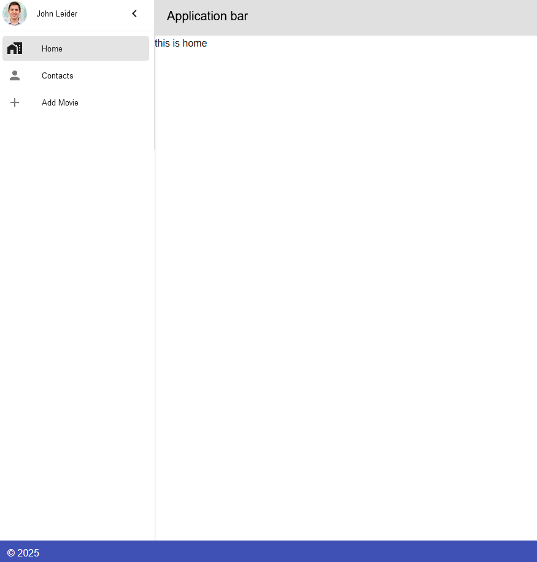
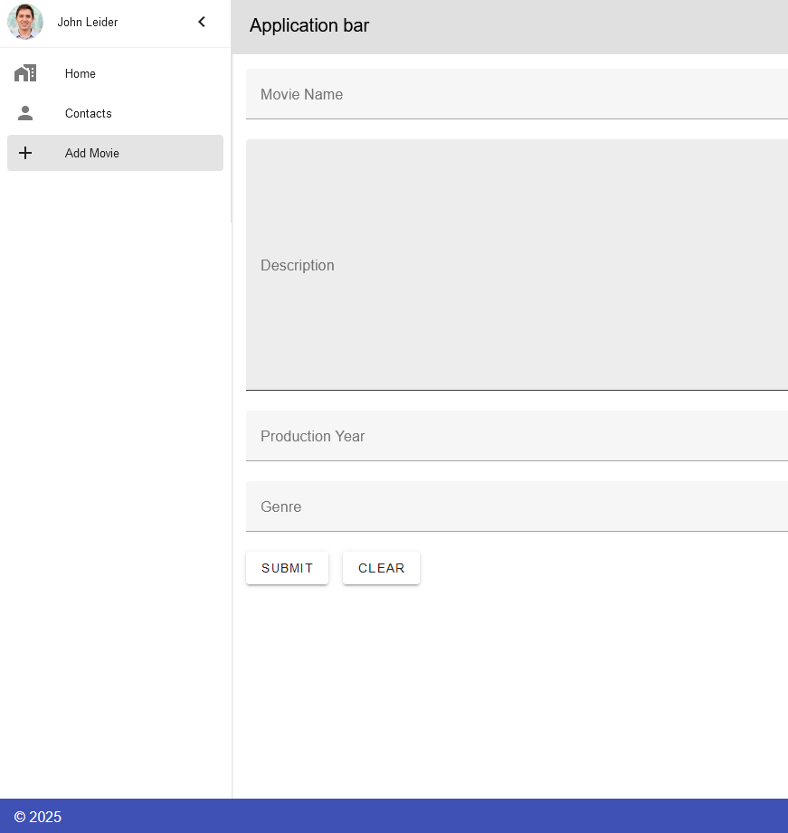
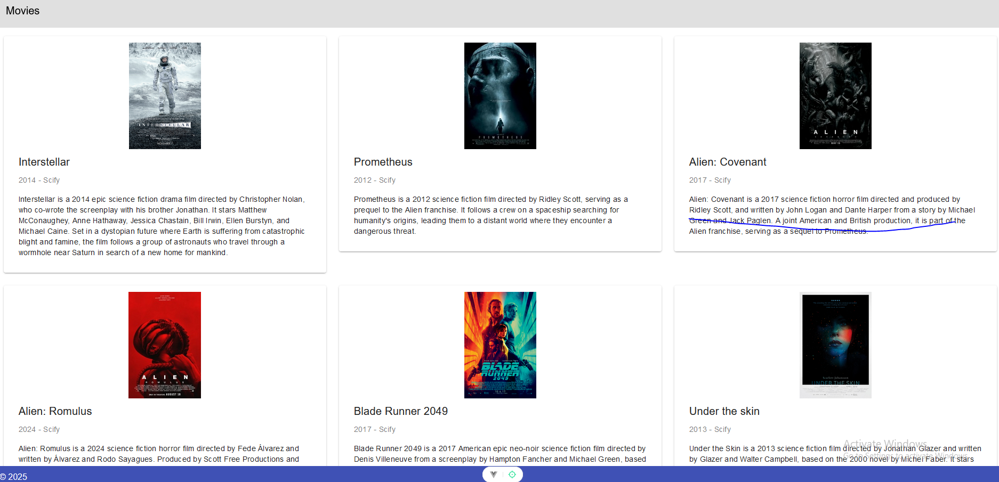

# Description

- \*\* Ver. 0.0.0
  This will be a web movie rating app , where people may create an account and create a list of movies they like with a rating. Users will also be able to share between themselves their list.

- \*\*Ver 0.1.0
- \*\* A back end was added with a get end point and post end point.
- \*\* Now you can add movies.
- \*\* On the home tab you can view your added movies.

# webStore

This template should help get you started developing with Vue 3 in Vite.

## Recommended IDE Setup

[VSCode](https://code.visualstudio.com/) + [Volar](https://marketplace.visualstudio.com/items?itemName=Vue.volar) (and disable Vetur).

## Customize configuration

See [Vite Configuration Reference](https://vite.dev/config/).

## Project Setup

At the moment there is only a bare minimum of front-end ,
go to front-end with:

```sh
cd front_end
```

and follow the next step

```sh
npm install
```

### Compile and Hot-Reload for Development

```sh
npm run dev
```

### Compile and Minify for Production

```sh
npm run build
```
